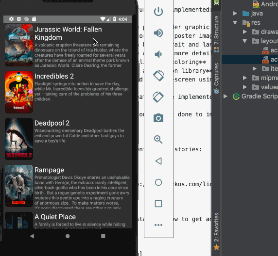

# Project 1 - *Flixter*

**Flixter** is an android app that allows scrolling through a list of movies obtained from a database, tapping for more details, and supports both landscape and portrait mode. 

Submitted by: **Julia Son**

Time spent: **6** hours spent in total

## User Stories

The following **required** functionality is completed:

* [X] User can **view a list of movies (title, poster image, and overview) currently playing in theaters form the Movie Database API**

The following **optional** features are implemented:

* [X] User can **display a nice placeholder graphic for each loading image**
* [X] User can **view rounded corners on poster images**
* [X] User can **use the app in both potrait and landscape mode**
* [X] User can **select a movie and view more details for the movie**
* [X] Improved **UI through styling and coloring**
* [ ] **Applied the Butterknife annotation library**
* [ ] **Allow posts to be played in full-screen using the YoutubePlayerView**

The following **additional** features are implemented:

* [ ] List anything else that you can get done to improve the app functionality!

## Video Walkthrough

Here's a walkthrough of implemented user stories:

GIF created with [LiceCap](http://www.cockos.com/licecap/).

## Notes

Having difficulty really understanding how to get an image to load separate from the recycler view.

## License

    Copyright [2018] [Julia Son]

    Licensed under the Apache License, Version 2.0 (the "License");
    you may not use this file except in compliance with the License.
    You may obtain a copy of the License at

        http://www.apache.org/licenses/LICENSE-2.0

    Unless required by applicable law or agreed to in writing, software
    distributed under the License is distributed on an "AS IS" BASIS,
    WITHOUT WARRANTIES OR CONDITIONS OF ANY KIND, either express or implied.
    See the License for the specific language governing permissions and
    limitations under the License.
